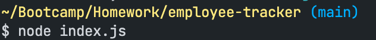
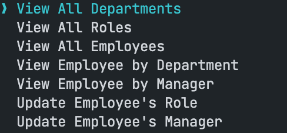
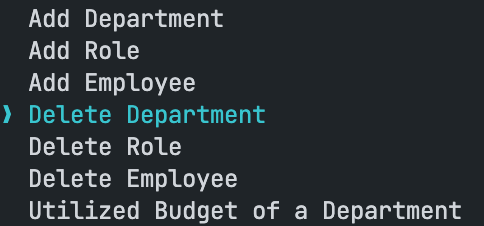
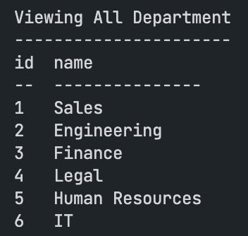
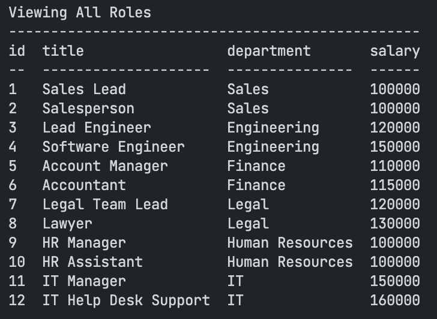
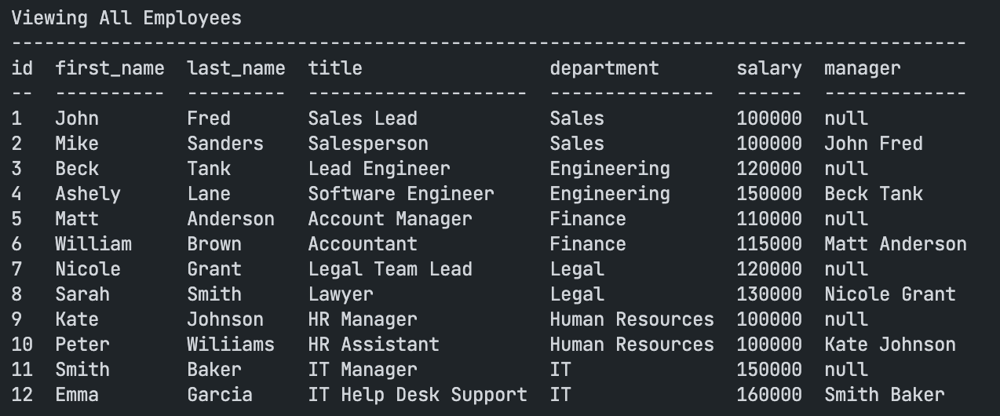

# Employee-Tracker

## Table of Content 

- [Description](#description)
- [Usage](#usage)
- [Installation](#installation)
- [Visuals](#visuals)
- [Resources](#resources)
- [Authors and Acknowledgement](#authors-and-acknowledgement)

## Description 

This is a command line application that allow the user to view the employee tracker using mysql to create the database

This application allow the user to:
- View All Department 
- View All Roles
- View All Employees
- View Employee by Department
- View Employee by Manager
- Update Employee's Role
- Update Employee's manager
- Add Department
- Add Role
- Add Employee 
- Delete Department
- Delete Role 
- Delete Employee
- View Utilized Budget of a Department

## Usage

How to use this command line employee tracker application:

- Step 1: Download all the necessary packages (mysql2, inuqirer, console.table)

- Step 2: In your terminal, type "node index.js" in the terminal

- Step 3: Choose one of the menu selection and it should do what it say it should do

## Installation 

This installation will connect to the mysql2 database 

```
npm i mysql2
```

This installation will prompt the menu selection and interact with it in terminal 

```
npm i inquirer
```

This installation will display a foramtted table 

```
npm i console.table
```

## Visuals

This is the command to start the program 



This is the list of menu selection the user can choose from





This is a sample of a few menu selection

- View All Departments



- View All Roles



- View All Employees



## Resources 

- [GitHub Repo](https://github.com/VanessaLiaw021/employee-tracker)

- [Demo]()

## Authors and Acknowledgement

Coded by Vanessa Liaw